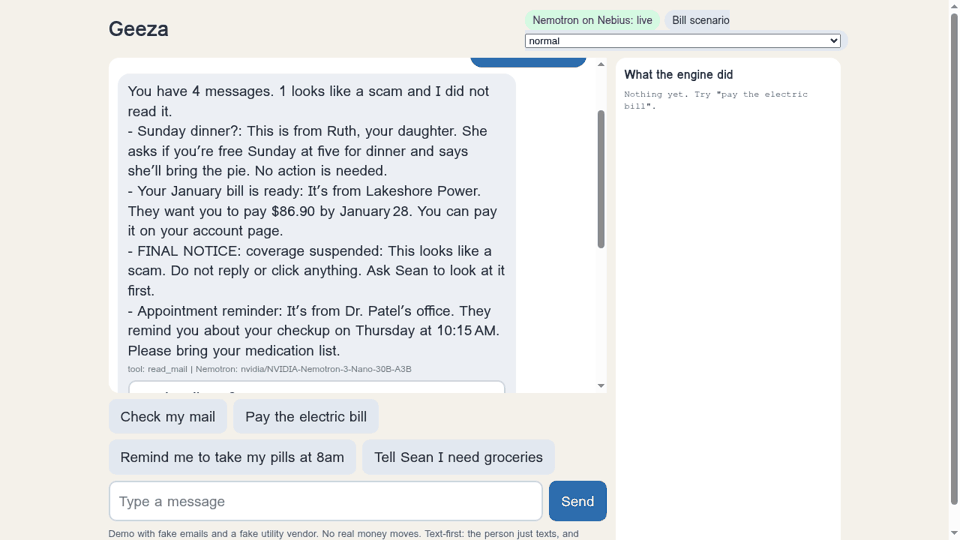

# Geeza

A personal AI companion for older adults, built for the Nebius x NVIDIA Global AI Hackathon (Personal AI track).

The goal: help with everyday online chores such as reading mail, spotting scams, and walking through routine tasks like paying a bill or refilling a prescription, in plain language and one step at a time.

## Status: early

This repo is a design plus working building blocks. It is a working demo on synthetic data, not a finished product.

What exists today:

- `engine/` - deterministic flow engine in Python (stdlib only) with unit tests
- `flows/` - JSON definitions for task flows
- `laya/` - small classifier heads and synthetic training data for mail triage and scam screening
- `docs/` - scope, architecture and decisions
- `ios/` - planned iOS module map (no app code yet)

All sample data in this repo is synthetic. The project started before the hackathon opened (originally named Boosh).

## Hackathon build

System 2 (the model that reads, explains and chats) is NVIDIA Nemotron on Nebius Token Factory, behind an OpenAI-compatible client with an offline mock fallback (`engine/boosh_flow/nebius.py`). Decision record: `docs/DECISIONS.md` D12.

- Scam screen: keyword and sender-domain rules run first. The model can add a warning but cannot clear one. A flagged message is never read aloud.
- Mail read-back: the model explains clean mail in plain words.
- Bill pay: the real flow engine runs against a fake utility vendor (`flows/examples/demo-utility-pay.json`). The amount-sanity gate and the approval step are code. The model cannot skip them, and the person's YES only covers the amount they were shown.
- Tool loop: the model proposes a tool call as JSON (`engine/boosh_flow/tools.py` registry: read_mail, scam_check, pay_bill, set_reminder, tell_caregiver). Code validates it. Tools that act (pay, remind, draft a note to the caregiver) only run after the person replies YES; a note is saved as a draft and never sent. Reminders in the demo are stored in memory and shown on screen, not sent to a phone.
- Interface: text-first. `gateway/server.py --demo` serves a chat page and the `/message` endpoint.

Status: live demo at https://geeza.onrender.com (free Render instance, so the first load after idle can take about a minute). The deployed demo calls Nemotron Nano 30B on Nebius Token Factory; the key is a server-side secret and is not in this repo. Mail read-back, scam screen, reminders and the caregiver draft were checked live against it; the bill-pay flow runs on the engine against a fake vendor. Only the Nano model is wired in so far.

Run the demo locally (offline mock without a key):

    NEBIUS_API_KEY=... python gateway/server.py --demo --port 8080

The key is read from the environment only. All emails, vendors and amounts in the demo are fake.

## Run the engine tests

    cd engine && python -m unittest discover -s tests -t .

## License

MIT. See LICENSE.

What changed since Aug 26: [docs/CHANGES-SINCE-AUG-26.md](docs/CHANGES-SINCE-AUG-26.md). Devpost draft: [docs/DEVPOST.md](docs/DEVPOST.md).

Demo memory: say "What do you remember?", "Remember that I like tea" or "Forget tea". Seed facts are invented (`memory/demo-memory/`); new notes need YES and last only for the visit. Design: D13 in docs/DECISIONS.md.
